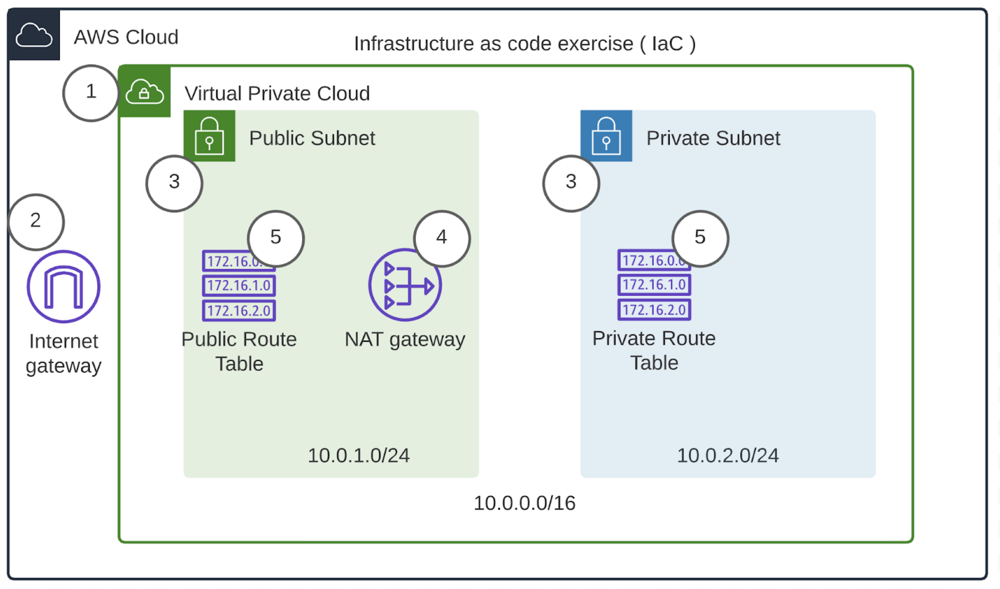
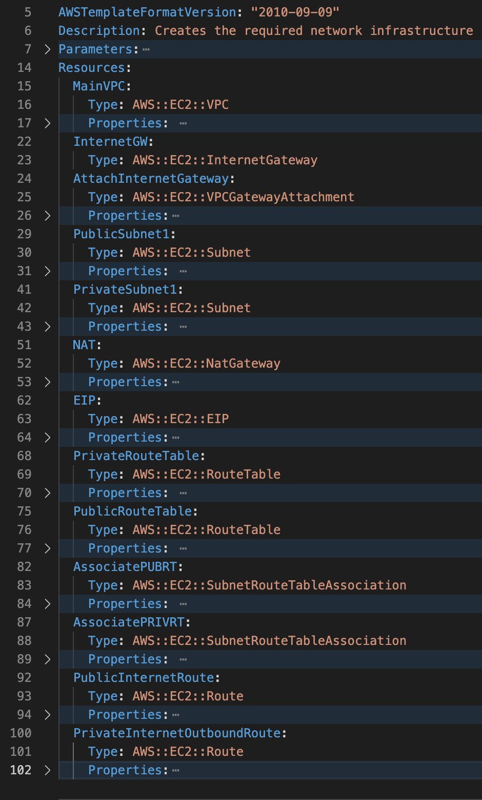
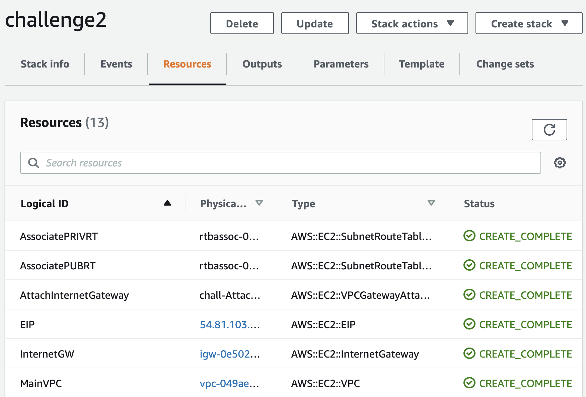
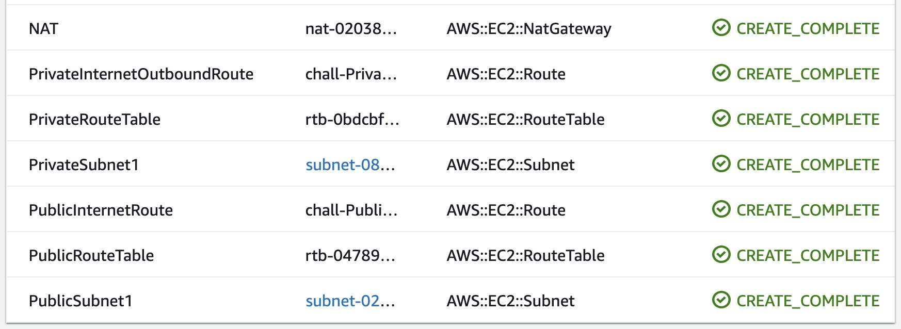

# Challenge 2

## Project Overview

You have been tasked with creating the required Infrastructure-as-code scripts for a new cloud environment in AWS. The Lead Solutions Architect for the project sends you the following diagram.

## ToDo

Write a CloudFormation script that:

1.  Creates a VPC
    - It will accept the IP Range -also known as CIDR block- from an input parameter

2.  Creates and attaches an Internet Gateway to the VPC

3.  Creates Two Subnets within the VPC with Name Tags to call them “Public” and “Private”
    - These will also need input parameters for their ranges, just like the VPC.

4.  The Subnet called “Public” needs to have a NAT Gateway deployed in it
    - This will require you to allocate an Elastic IP that you can then use to assign it to the NAT Gateway.

5.  The Public Subnet needs to have the MapPublicIpOnLaunch property set to true. Use this [reference](https://docs.aws.amazon.com/AWSCloudFormation/latest/UserGuide/aws-resource-ec2-subnet.html#cfn-ec2-subnet-mappubliciponlaunch) for help.

6.  The Private Subnet needs to have the MapPublicIpOnLaunch property set to false.

7.  Both subnets need to be /24 in size.
    - If you need assistance with IP math, you can use a subnet calculator such as this one.

8.  You will need 2 Routing Tables, one named Public and the other one Private

9.  Assign the Public and Private Subnets to their corresponding Routing table

10. Create a Route in the Public Route Table to send default traffic ( 0.0.0.0/0 ) to the Internet Gateway you created

11. Create a Route in the Private Route Table to send default traffic ( 0.0.0.0/0 ) to the NAT Gateway

12. Finally, once you execute this CloudFormation script, you should be able to delete it and create it again, over and over in a predictable and repeatable manner, this is the true verification of working Infrastructure-as-Code

## Helpful hints:

1.  The numbers in the diagram above/below show the recommended sequence for resource creation. This is not required by CloudFormation but it helps to keep you on track and allows you to stop and verify as you go.

2.  Because NAT Gateways and Internet Gateway attachments aren’t automatic and take some time to provision, you may need the DependsOn attribute to wait for these events in your script.

This NAT Gateway example shows the use of “DependsOn” to wait for an Attachment to complete:

https://docs.aws.amazon.com/AWSCloudFormation/latest/UserGuide/aws-resource-ec2-natgateway.html

3.  Finally: Divide and Conquer! For example: just write the script for the VPC and Internet Gateway and make sure it works, then move on to adding more resources, increasing complexity as you go.

## Expected Output

The stack details should show you the list of resources created successfully:

