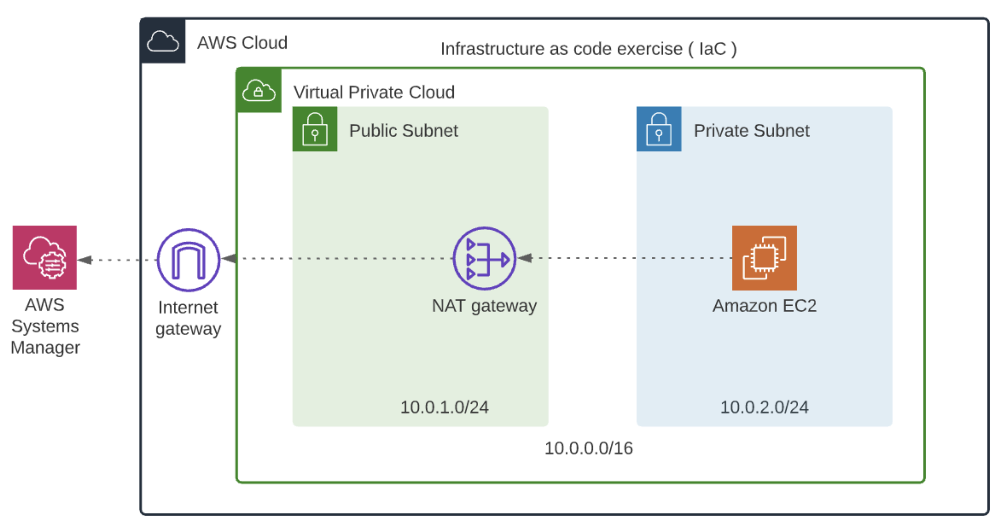

## Challenge 3

The ToDo in the current challenge is continuing to the Challenge 2 that you must have completed in the previous lesson.

### Prerequisites

- You will need the VPC ID and Subnet ID from the previously created stack in Challenge 2.

**Overview**

In this exercise, you have been tasked with deploying a Linux server in a private subnet, using the infrastructure that you created in a previous exercise. In the future, this machine will be a web server that sits behind a load balancer, so it never needs to be public, as long as the Load Balancer can reach it.

If you look at the diagram it shows the EC2 Server connecting to AWS Systems Manager. This service will allow you to connect to this server and verify it’s working properly. This is because you cannot SSH into a server over the internet if it doesn’t have a public IP address. Actually, you could, if you set up a VPN inside your VPC, but that’s beyond the scope of this exercise.

In order to connect your instance to AWS Systems Manager, you will be using Amazon Linux 2 for your AMI, since it’s already installed and configured in there.

**ToDo**

Use the infrastructure we created earlier to build and deploy the following:

1.  **EC2 Instance:** An Amazon Linux 2 EC2 server in the private subnet. Choose the right AMI ID as applicable to your region and the `t3.micro` instance-type.

2.  **SecurityGroup:** A security group for the server, that allows inbound port 80 access, for future use.

3.  **IAM Role and InstanceProfile:** The IAM Role to allow EC2 Session Manager to access our server. An InstanceProfile will allow passing the IAM role to our server.

4.  You will provide input parameters to this script, for future expansion and flexibility.

5.  Bonus/Optional: Instead of hard-coding the VPC and Subnet ID, use the import-export feature to cross reference the resources created in Challenge 2.